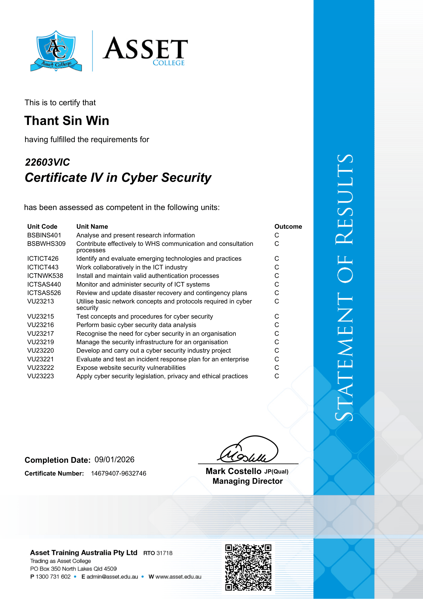
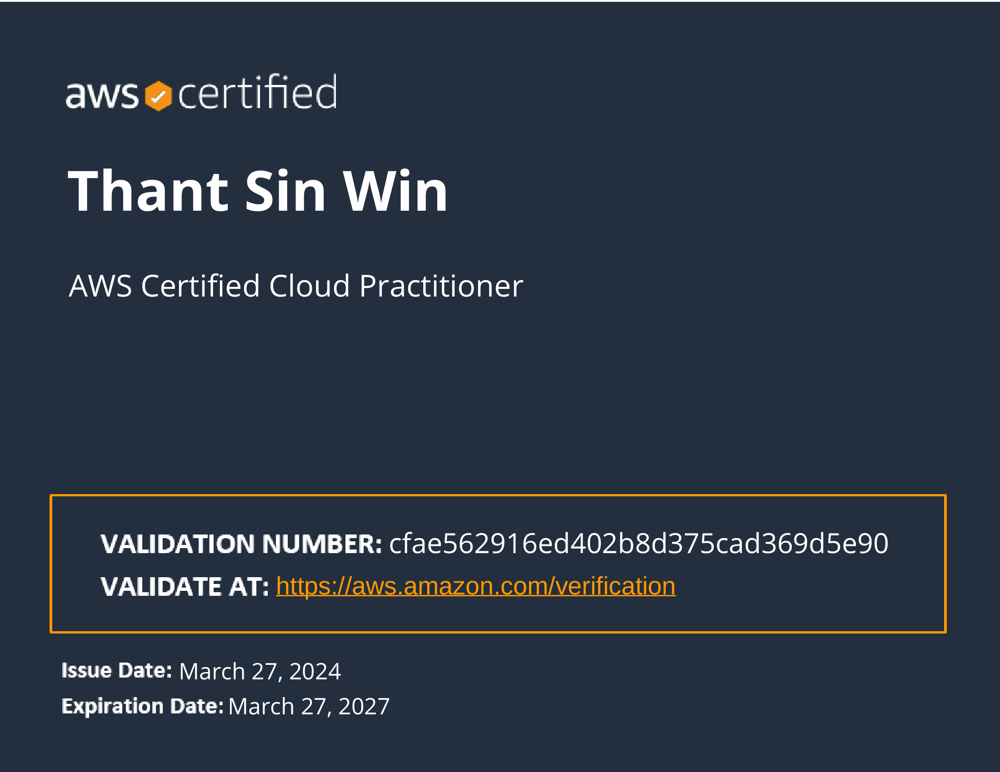
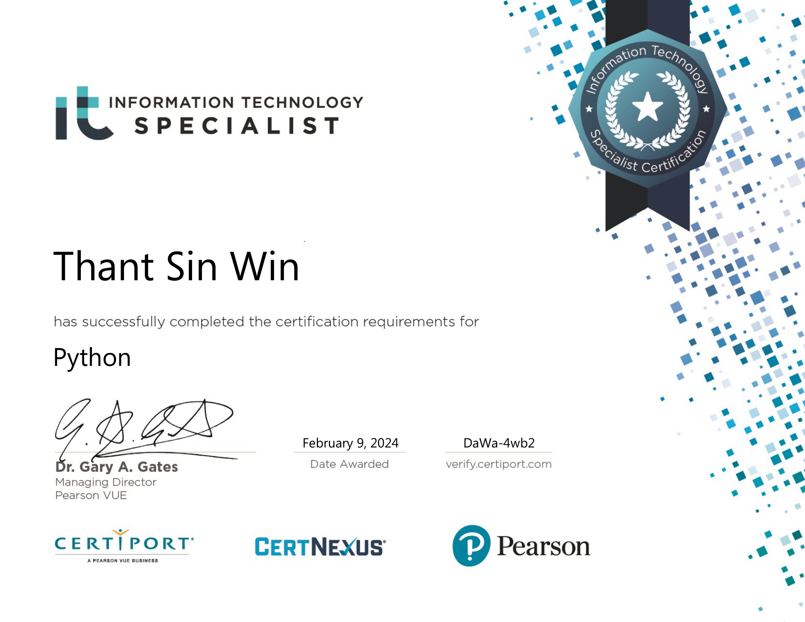
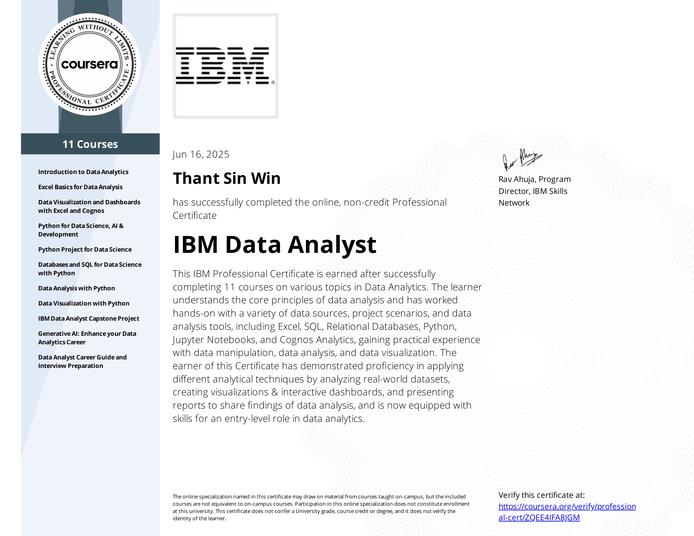
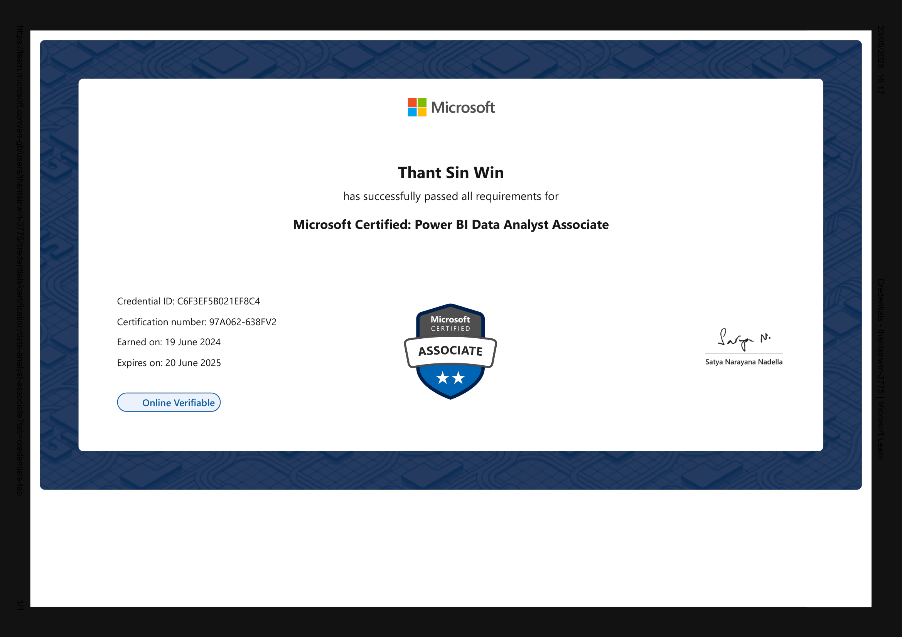

# Certifications

The following certifications support foundational knowledge in cyber security, cloud platforms, scripting and data analysis.

---

## Certificate IV in Cyber Security

---

## AWS Certified Cloud Practitioner

---

## Certified IT Specialist Python

---

## Microsoft Certified Power BI Data Analyst Associate

---

## IBM Data Analyst Professional Certificate

