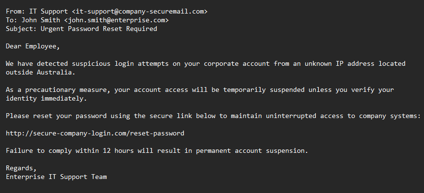
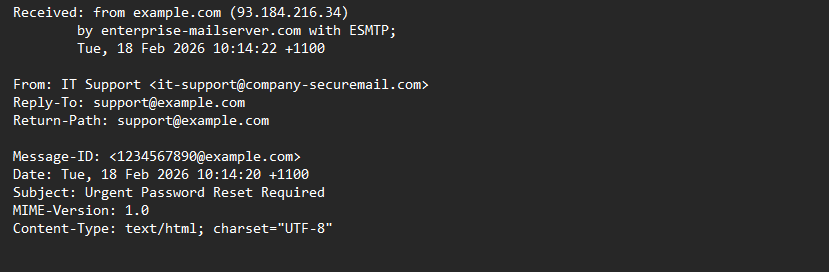
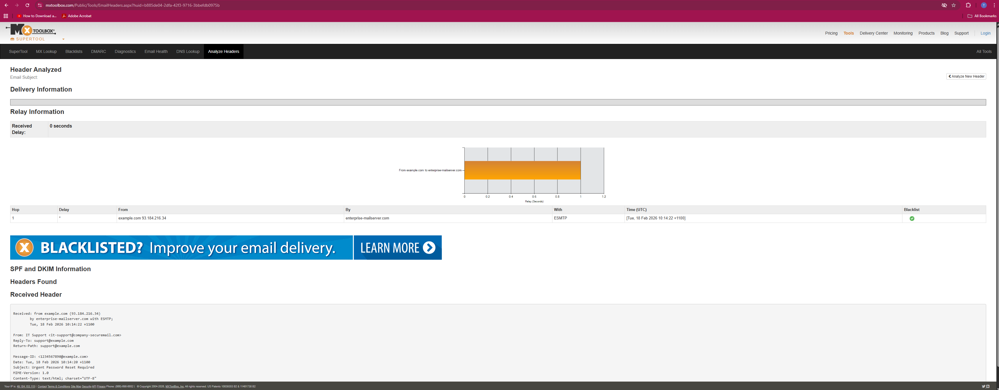
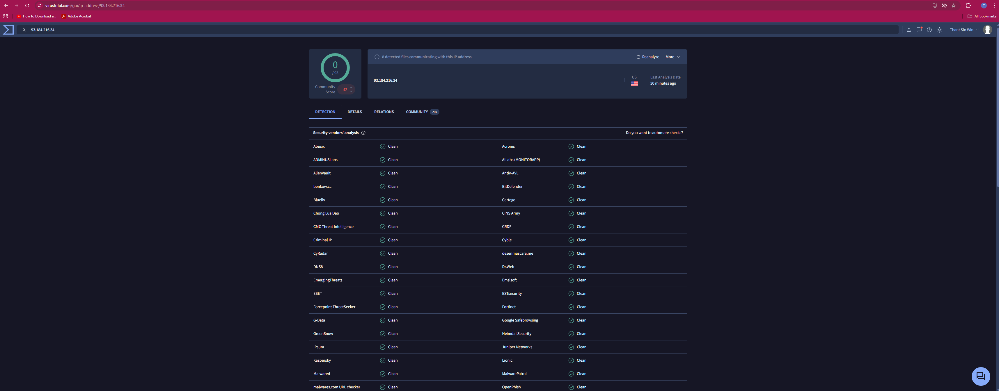
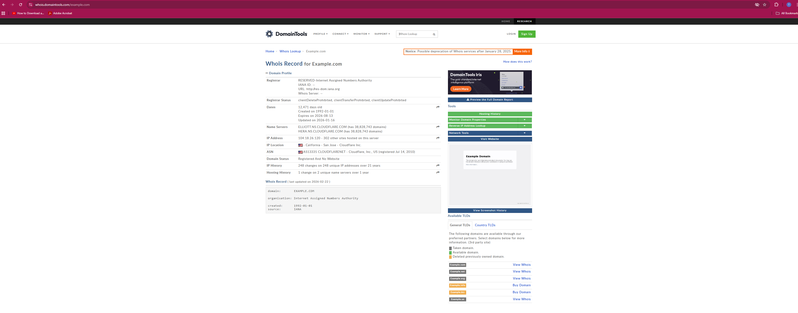
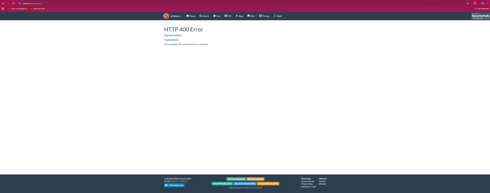
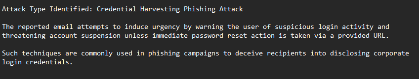
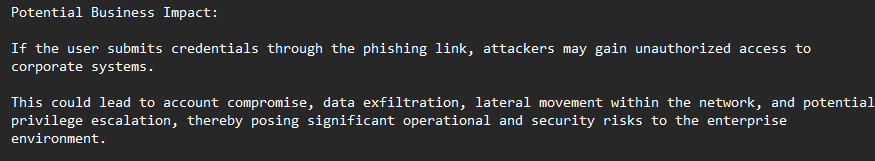
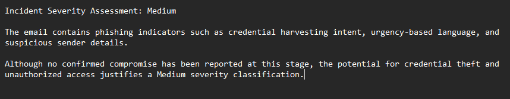
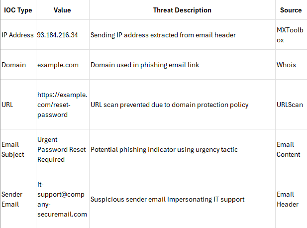

# Enterprise Phishing Email Investigation & Threat Analysis Lab

## Overview

This project simulates a Tier 1 Security Operations Centre (SOC) investigation involving a reported phishing email received by an employee. The email claimed to originate from an internal IT Support function and requested an urgent password reset through an embedded hyperlink.

The objective of this case study is to follow a structured investigation process, document Indicators of Compromise (IOCs), assess business risk, and produce an incident report suitable for SOC documentation and escalation.

---

## Investigation Workflow

- Email content review (social engineering indicators)
- Email header analysis
- Sender IP reputation check
- Domain registration lookup (Whois)
- URL reputation analysis
- IOC documentation
- Threat classification
- Severity assessment
- Mitigation recommendations
- Incident report documentation

---

## Tools Used

| Tool | Purpose |
|------|--------|
| MXToolbox | Email Header Analysis |
| VirusTotal | IP Reputation Check |
| Whois Lookup | Domain Registration Analysis |
| URLScan | URL Reputation Analysis |
| Microsoft Excel | IOC Documentation |

---

## Key IOCs Identified

- Sending IP Address: 93.184.216.34  
- Domain: example.com  
- URL: https://example.com/reset-password  
- Sender Email Address: it-support@company-securemail.com  
- Email Subject: Urgent Password Reset Required  

---

## Threat Assessment Summary

The reported email was assessed as a credential harvesting phishing attempt. The message used urgency-based language and a password reset request to pressure the recipient into taking immediate action.

Although no confirmed compromise was identified during this investigation, successful execution could result in account takeover, unauthorized access to corporate systems, data exposure and potential lateral movement. Based on the evidence available, the incident was rated **Medium severity**.

---

## Recommended Mitigation Actions

1. Block the domain example.com at the enterprise web proxy or firewall level.  
2. Block the sender email address it-support@company-securemail.com.  
3. Advise users not to click the link or disclose credentials.  
4. Send an internal phishing awareness reminder if similar emails are observed.  

---

## Investigation Evidence

### 1) Reported Email Content

### 2) Email Header Captured for Analysis

### 3) Header Analysis (MXToolbox)

### 4) Sender IP Reputation (VirusTotal)

The sending IP address returned a clean reputation score (0/93 detections) on VirusTotal at the time of analysis.

It should be noted that a clean reputation score does not necessarily indicate legitimacy, as newly registered or low-activity infrastructure used in phishing campaigns may not yet be flagged by security vendors. Such findings were considered alongside other phishing indicators identified during the investigation.

### 5) Domain Registration (Whois)

### 6) URL Analysis Attempt (URLScan)

URL analysis of the embedded hyperlink was attempted using URLScan. The scan was prevented due to platform restrictions likely associated with domain protection policies. This limitation was documented as part of the investigation.

### 7) Threat Classification

### 8) Potential Business Impact

### 9) Severity Assessment

### 10) IOC Documentation

---

## Investigation Report

A detailed investigation report has been included in Markdown format for direct review:

[View Investigation Report](InvestigationReport.md)
