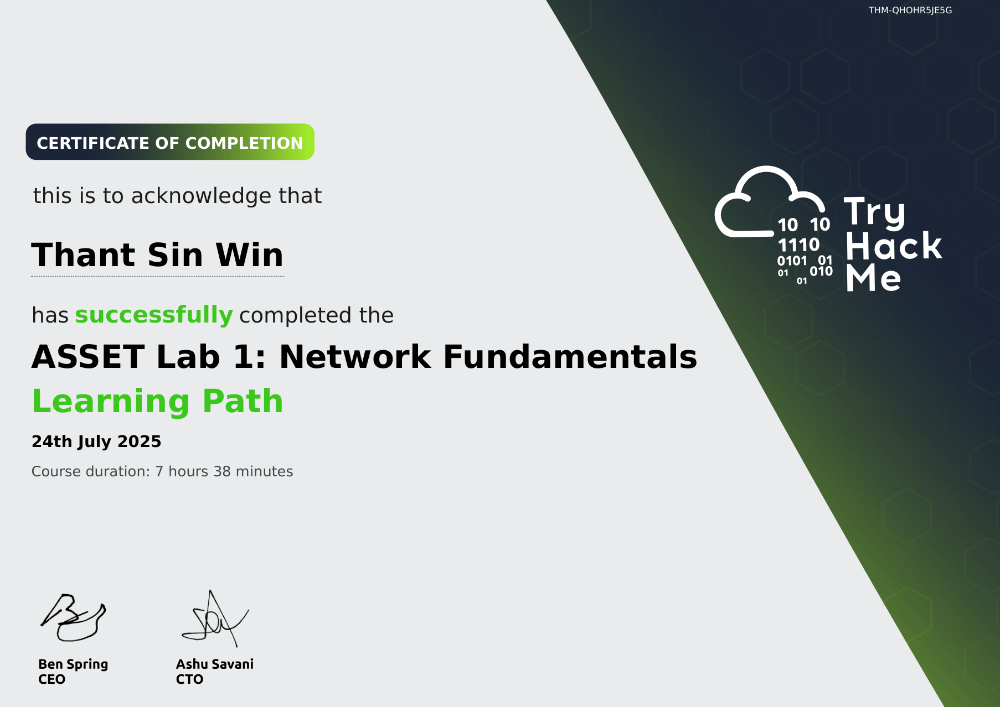
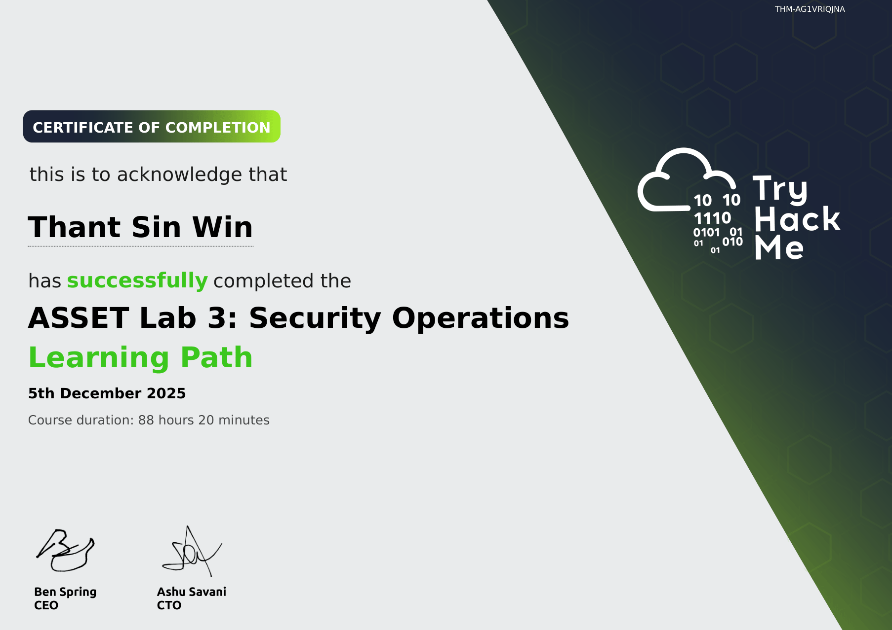

# TryHackMe Practical Training

The following structured learning paths were completed through TryHackMe as part of hands on cybersecurity training with a focus on SOC related concepts including threat detection, incident response and security monitoring workflows.

---

## Network Fundamentals

---

## Web Fundamentals

---

## Security Operations

---

## Penetration Testing

---

## SOC Analyst

